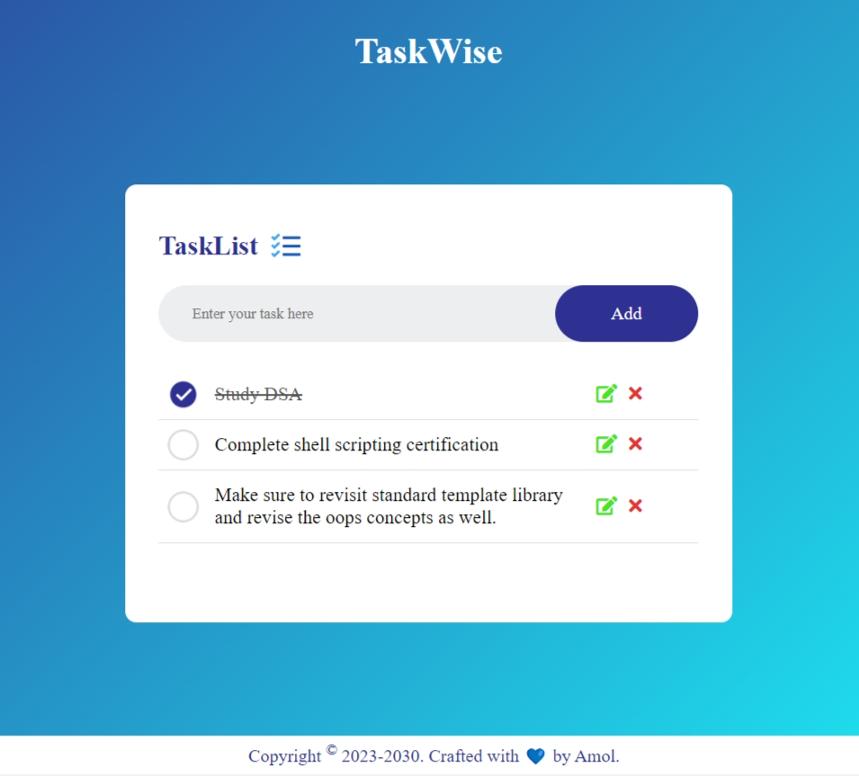

# 🔥🚀 TaskWise - Task Management Web Application 🌈✨

TaskWise is a simple web application that empowers users to efficiently manage their tasks. With TaskWise, you can seamlessly do CRUD operation, that is add, read, edit, and remove tasks on the fly. Keeping your productivity at its peak.

## 

## 

## 🛠️ Tech Stack

- 🌐 **HTML5**
- 🎨 **CSS3**
- ☕ **JavaScript**

## 🌟 Features

- ✍️ Add Tasks: 📝 Enter your task in the input field and hit the "Add" button to seamlessly add it to your task list.
- ✏️Edit Tasks: 👆Click on the edit icon next to a task to instantly edit its content inline. Your changes will be applied in real-time.
- ❌Remove Tasks: 👆If you want to remove a task, simply click on the remove icon next to it, and watch it vanish from your list.
- ✅Mark Tasks as Complete: 👆Click on a task to mark it as complete. Completed tasks will be crossed out for easy identification.

## 🔍 How it Works

- 🔄 **Local Storage**: TaskWise leverages the browser's local storage to save and manage tasks. On page load, tasks are retrieved from localStorage and displayed, ensuring your data is always available.

## 📝 Contributing

Contributions are welcome! If you have any ideas for improvements or new features, feel free to **open an issue** or **submit a pull request**.🙌

## 👤 Author

TaskWise is crafted with 💙 by **Amol**. 🌟
